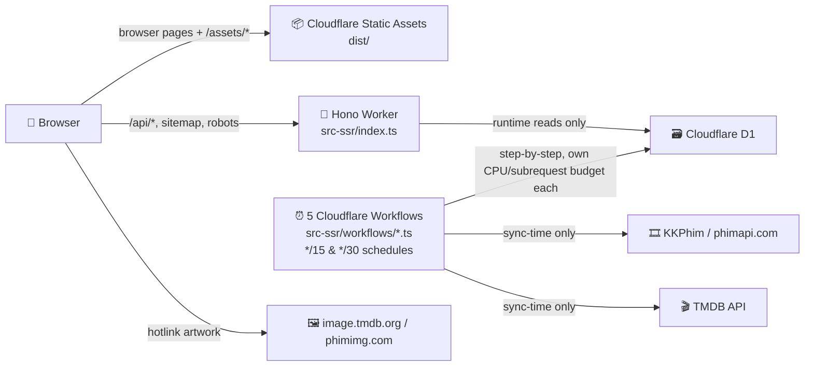

<div align="center">

# 🎬 Redflare

**Film Bluesia — web xem phim tiếng Việt chạy trên Cloudflare**

[🌐 Production](https://phim.bluesia.net) · [🎨 Design system](docs/DESIGN.md) · [📜 API contract](docs/contract-legacy-api.md) · [🧭 Handoff](docs/HANDOFF.md)

🪶 Vanilla JavaScript SPA · ⚡ Vite · 🧠 Hono Worker · 🗃️ Cloudflare D1 · 🎞️ ArtPlayer + hls.js

</div>

---

> [!IMPORTANT]
> Đây là mô tả kiến trúc hiện tại, đã audit trực tiếp từ code ngày **2026-08-13**. Redflare **không còn VPS, KV, R2, pipeline mirror ảnh hay SSR page renderer**. Kể từ 2026-08-13, catalog sync cũng **không còn một Cron Trigger `scheduled()` duy nhất** — 5 job chạy độc lập qua **Cloudflare Workflows**, mỗi job tự lịch riêng (xem [5 Cloudflare Workflows nuôi catalog](#️-dữ-liệu-và-đồng-bộ)). Lý do: `docs/state-free-plan-migration.md` Phase 5 — thiết kế cũ (5 job dùng chung một invocation) bị Cloudflare kill vì vượt CPU time khi CPU limit được set về 10ms (giả lập Free plan). Một số comment/tài liệu lịch sử vẫn nhắc kiến trúc cũ; khi mâu thuẫn, ưu tiên `README.md` → code đang chạy → `docs/plan-free-plan-migration.md`/`docs/state-free-plan-migration.md` → `docs/contract-legacy-api.md` → `docs/HANDOFF.md`.

## 🧭 Mục lục

1. [✨ Redflare làm gì?](#-redflare-làm-gì)
2. [🏗️ Kiến trúc hiện tại](#️-kiến-trúc-hiện-tại)
3. [🗺️ Bản đồ codebase](#️-bản-đồ-codebase)
4. [🎨 Frontend SPA](#-frontend-spa)
5. [🧠 Worker và API](#-worker-và-api)
6. [🗃️ Dữ liệu và đồng bộ](#️-dữ-liệu-và-đồng-bộ)
7. [🖼️ Chính sách ảnh](#️-chính-sách-ảnh)
8. [🚀 Zero to hero: triển khai từ đầu](#-zero-to-hero-triển-khai-từ-đầu)
9. [🧪 Phát triển và kiểm thử](#-phát-triển-và-kiểm-thử)
10. [🛠️ Vận hành](#️-vận-hành)
11. [🛡️ Bảo mật và cache](#️-bảo-mật-và-cache)
12. [🤖 Luật dành cho AI agent](#-luật-dành-cho-ai-agent)
13. [🧯 Troubleshooting](#-troubleshooting)

## ✨ Redflare làm gì?

- 🏠 **Trang chủ cinematic** với hero slider, phim mới, trending, phim lẻ và phim bộ.
- 🎬 **Trang chi tiết** có metadata, diễn viên, trailer, tập phim và recommendation.
- ▶️ **Player thống nhất** bằng ArtPlayer + hls.js; fallback sang iframe khi không có HLS.
- 🔎 **Tìm kiếm local bằng SQLite FTS5**, hỗ trợ tiếng Việt có dấu/không dấu.
- 🗂️ **Danh mục, thể loại, quốc gia** với URL sạch và phân trang `?page=N`.
- 📱 **Responsive desktop/mobile**, gồm cả chế độ mobile landscape.
- ⚡ **Request người dùng không gọi KKPhim/TMDB**: browser chỉ đọc dữ liệu đã chuẩn hóa trong D1.
- 🤖 **5 Cloudflare Workflows tự nuôi catalog**: incremental sync, hero snapshot, resolve/refresh recommendation, backfill — mỗi job một lịch riêng, mỗi step tự ngân sách CPU/subrequest riêng.

## 🏗️ Kiến trúc hiện tại



### Ba nguyên tắc cốt lõi

1. 🪶 **SPA sở hữu UI** — Vite build `src/` thành `dist/`; Cloudflare Static Assets phục vụ trực tiếp.
2. 🗃️ **D1 là source of truth runtime duy nhất** — `/api/*` không fetch API ngoài khi user mở trang.
3. ⏰ **Upstream nằm ngoài user request path** — chỉ scheduled sync và route ops có `CRON_KEY` mới gọi KKPhim/TMDB, nên upstream chậm không làm request người dùng thành 504.

### Một domain, hai đường xử lý

| Request | Ai xử lý? | Có chạy Worker? |
|---|---|---|
| `/`, `/phim/:slug`, `/danh-sach/*`, `/the-loai/*`, `/quoc-gia/*` | Static Assets + SPA fallback | Không |
| `/assets/*`, logo, font | Static Assets | Không |
| `/api/*` | Hono Worker → D1 | Có |
| `/sitemap*.xml`, `/robots.txt` | Hono Worker → D1 | Có |
| `/__sync/*` | Hono Worker, khóa bằng `CRON_KEY` | Có |

`wrangler.toml` dùng `assets.run_worker_first` để giữ các route động đi qua Worker. Xóa hoặc cấu hình sai danh sách này sẽ khiến `/api/*` trả `index.html` thay vì JSON.

## 🧱 Tech stack

| Lớp | Công nghệ | Ghi chú |
|---|---|---|
| UI | Vanilla JavaScript ES Modules | Không React/Vue/Svelte |
| Styling | CSS thuần, BEM-like | Không Tailwind |
| Build | Vite 8 | Output `dist/` |
| Router | History API tự viết | URL sạch, không hash routing |
| Worker | Hono + TypeScript | File vẫn nằm trong `src-ssr/`, nhưng không còn render page SSR |
| Database | Cloudflare D1 / SQLite | Runtime storage duy nhất |
| Search | SQLite FTS5 | Prefix search, normalize tiếng Việt |
| Video | ArtPlayer + hls.js/light | Native HLS/iframe fallback |
| Font | `@fontsource/inter` | Self-host Latin + Vietnamese, weight 400/500/700/900 |
| Deploy | Cloudflare Workers + Static Assets | Một Worker, một D1, một custom domain |

## 🗺️ Bản đồ codebase

```text
redflare/
├── src/                         # 🎨 Vanilla JS SPA
│   ├── main.js                  # App entry, route handlers, global UI
│   ├── router.js                # History API router
│   ├── api/ophim.js             # Network client duy nhất của SPA → /api/*
│   ├── components/              # MovieDetail
│   ├── modules/                 # Header, Hero, Grid, Player, Search, Card...
│   ├── lib/                     # Image, lazy mount, Media Session
│   └── styles/                  # Premium UI hiện tại
├── src-ssr/                     # 🧠 Worker backend (tên thư mục là di sản)
│   ├── index.ts                 # Hono fetch entrypoint + Workflow class re-exports
│   ├── api/                     # JSON API tương thích SPA
│   ├── routes/                  # Sync, sitemap, robots
│   ├── repositories/            # Mọi truy cập D1
│   ├── services/sync/           # KKPhim/TMDB sync + normalize + backfill
│   ├── workflows/                # 5 Cloudflare Workflow class, mỗi job một file
│   ├── middleware/              # CSP, CRON_KEY, validation, sampling
│   └── types/                   # Env + model types
├── migrations/                  # 🗃️ D1 migrations 0001 → 0009
├── public/                      # Logo + Cloudflare `_headers`
├── docs/                        # Contract, ADR, design, plans, state logs
├── index.html                   # SPA shell
├── vite.config.js               # Vite + proxy production API
├── wrangler.toml                # ✅ Production source of truth
├── tsconfig.worker.json         # Typecheck Worker
└── package.json                 # Scripts + dependencies
```

> [!NOTE]
> `src-ssr/` giữ tên cũ để tránh một đợt rename lớn. Hiện tại thư mục này chỉ là Worker JSON/API + sync + sitemap. Các page renderer SSR đã bị xóa.

## 🎨 Frontend SPA

### Route map

| URL | Handler | Data source |
|---|---|---|
| `/` | Home + hero + carousel | `/api/home-data` |
| `/phim/:slug` | Detail + player + recommendation | `/api/movie/:slug`, `/api/recommendation/*` |
| `/danh-sach/:type?page=N` | Grid danh sách | `/api/list` |
| `/the-loai/:slug?page=N` | Grid thể loại | `/api/genre` |
| `/quoc-gia/:slug?page=N` | Grid quốc gia | `/api/country` |
| `/tim-kiem?q=...` | Mở search overlay | `/api/search` |

Router dùng HTML5 History API và intercept link nội bộ. Cloudflare Static Assets chịu trách nhiệm trả `index.html` cho deep link.

### Module đáng chú ý

| Module | Trách nhiệm |
|---|---|
| `HeroSlider` | Hero full-bleed, preload LCP, rotate slide, rail nhỏ |
| `Carousel` | Hàng poster ngang + arrow desktop + eased scrolling |
| `PosterCard` | Poster, badge/metadata overlay, navigation, ảnh `w185` |
| `Grid` | Grid danh mục + numbered pagination |
| `SearchOverlay` | Overlay blur + recent searches + Invisible Turnstile khi debounce hoàn tất |
| `MovieDetail` | Backdrop, metadata, episodes, trailer, recommendation |
| `Player` | ArtPlayer/hls.js, recovery, iframe fallback, Media Session |
| `Header` | Nav, search, mobile menu, sticky global back button |

### Performance frontend

- 🚀 Hero đầu tiên được preload và ưu tiên cao.
- 💤 Ảnh mặc định `loading=lazy`, `decoding=async`; chỉ LCP candidates dùng eager/high priority.
- 👀 Các rail dưới fold được mount bằng `IntersectionObserver`.
- 📦 ArtPlayer và hls.js được dynamic import khi người dùng thật sự bấm phát.
- 🧠 API client có memory cache 5 phút trong một phiên SPA.
- 🖼️ Movie card dùng TMDB `w185`, đủ nét cho kích thước hiển thị và nhẹ hơn `w500`.

## 🧠 Worker và API

Entrypoint: `src-ssr/index.ts`. Worker chỉ nhận những route nằm trong `assets.run_worker_first`.

### Public API

| Method | Route | Vai trò |
|---|---|---|
| `GET` | `/api/home-data` | Tối đa 20 hero, 24 phim mới, 12 trending, 12 phim lẻ, 12 phim bộ |
| `GET` | `/api/movie/:slug` | Movie detail + episodes theo server |
| `GET` | `/api/list?type=&page=` | Phim mới hoặc danh sách theo type |
| `GET` | `/api/genre?slug=&page=` | Grid theo thể loại |
| `GET` | `/api/country?slug=&page=` | Grid theo quốc gia |
| `POST` | `/api/search` | FTS5 search, yêu cầu Turnstile token, tối đa 24 kết quả |
| `GET` | `/api/recommendation/:mediaType/:tmdbId` | Tối đa 12 phim đã resolve |
| `GET` | `/api/related/:mediaType/:tmdbId` | Alias tương thích |

Contract response cố ý giữ shape legacy mà SPA đang đọc. Đặc biệt `heroMovies` là mảng trần, trong khi bốn rail là `{ items: [...] }`. Đừng “làm đẹp” shape nếu chưa sửa đồng bộ frontend và [contract](docs/contract-legacy-api.md).

### Pagination guards

- Page size danh mục: `24`.
- `?page` bị clamp trong `[1, 200]` để giới hạn D1 rows-read do OFFSET.
- Search chỉ phục vụ page 1; UI overlay không yêu cầu page sau.
- Keyword dài hơn 100 ký tự trả kết quả rỗng.

## 🗃️ Dữ liệu và đồng bộ

### Schema hiện tại

| Table | Mục đích |
|---|---|
| `movie` | Movie normalized, ảnh, rating, popularity, source hash |
| `episode` | Episode/server/HLS/embed |
| `recommendation` | Edge TMDB → slug đã resolve hoặc pending/overflow |
| `genre`, `country` | Tên taxonomy |
| `genre_movie`, `country_movie` | Quan hệ many-to-many |
| `fts_movie` | FTS5 title/original title đã normalize |
| `sync_state` | Cursor, quota, backfill state, request sampling |

`slug` là primary key, không phải `tmdb_id`, vì TMDB ID có thể thiếu, trùng giữa movie/TV hoặc được dùng chung cho nhiều season slug. Khi lookup TMDB phải dùng cặp `(tmdb_type, tmdb_id)`.

Migrations `0001`–`0004` là schema legacy; `0006` xóa các bảng cũ. Với database mới vẫn chạy **toàn bộ migrations theo thứ tự** để Wrangler ghi đúng migration history. Không đổi tên `0005_ssr_schema.sql`: hậu tố là di sản nhưng filename đã thuộc migration history của production.

### Field ownership

| Nguồn | Sở hữu chính |
|---|---|
| KKPhim | slug, type, status, quality, language, taxonomy, actors, episodes, stream URLs |
| TMDB | title/overview ưu tiên, backdrop/poster, year, rating, popularity, trailer, recommendation IDs |
| D1 | Bản normalized cuối cùng được mọi request runtime đọc |

Nếu không có TMDB token, sync vẫn ghi được catalog KKPhim nhưng thiếu enrichment, hero/trending chất lượng cao và recommendation.

### 5 Cloudflare Workflows nuôi catalog

Không còn một Cron Trigger `scheduled()` duy nhất chạy tuần tự nhiều job (thiết kế cũ bị Cloudflare kill vì cộng dồn CPU time khi test ở giới hạn 10ms — xem `docs/state-free-plan-migration.md` Phase 5). Mỗi job giờ là một [Cloudflare Workflow](https://developers.cloudflare.com/workflows/) riêng (`src-ssr/workflows/*.ts`, khai báo ở `wrangler.toml` `[[workflows]]`), tự lịch chạy riêng, và **mỗi `step.do()` bên trong một Workflow tự có ngân sách CPU/subrequest riêng** — không cộng dồn qua các step hay qua các job khác.

| Workflow | Lịch | Việc làm |
|---|---|---|
| `IncrementalSyncWorkflow` | `*/30 * * * *` | Quét 2 trang gần nhất của feed phim mới; mỗi slug mới/đổi là một step riêng gọi `syncOneMovie` |
| `HeroSnapshotWorkflow` | `*/15 * * * *` (cổng 30 phút, nên thực chạy ~mỗi giờ) | Lấy TMDB trending; mỗi candidate là một step riêng |
| `RecommendationResolveWorkflow` | `*/15 * * * *` | Resolve target chưa có slug, ưu tiên target được nhiều phim tham chiếu; chia batch ~15 group/step |
| `RecommendationRefreshWorkflow` | `*/15 * * * *` | Làm mới danh sách recommendation ID từ TMDB; chia batch ~5 source/step |
| `BackfillWorkflow` | `*/15 * * * *`, **inert mặc định** | Chỉ chạy khi `BACKFILL_ENABLED="true"` (xem bảng dưới); mỗi step tối đa 5 trang |

Mỗi movie được normalize rồi hash. Nếu `source_hash` không đổi, pipeline ghi **0 row**, tránh đốt D1 write quota.

Các route ops thủ công (`/__sync/run`, `/__sync/resolve-recommendations`) vẫn dùng logic batch cũ (`orchestrator.ts` `runIncrementalSync`/`runRecommendationResolveTick`, fan-out qua `SELF`) cho mục đích debug/smoke-test tay — chỉ đường tự động qua cron mới đã chuyển hẳn sang Workflows.

### Backfill modes

`BackfillWorkflow` chỉ chạy khi được bật rõ ràng — catalog ban đầu coi như đã backfill xong, các biến dưới đây đều là `[vars]` trong `wrangler.toml`, sửa được thẳng trên Cloudflare dashboard ("Variables and secrets") **không cần redeploy**:

| Biến | Giá trị | Hành vi |
|---|---|---|
| `BACKFILL_MODE` | `free` | Mặc định; dừng khi đạt 85.000 row writes/ngày |
| `BACKFILL_MODE` | `burst` | Tắt governor; chỉ bật khi chắc chắn account đang ở Workers Paid |
| `BACKFILL_ENABLED` | `false` | **Mặc định** — `BackfillWorkflow` mỗi tick chỉ đọc 1 dòng D1 rồi return, gần như miễn phí |
| `BACKFILL_ENABLED` | `true` | Bật lại backfill (crawl mới, hoặc thêm listing type) |
| `BACKFILL_TYPE` | rỗng | Mặc định; đi lần lượt cả 4 type `phim-le → phim-bo → hoat-hinh → tv-shows` |
| `BACKFILL_TYPE` | một trong 4 type trên | Giới hạn backfill vào đúng type đó |
| `BACKFILL_PAGE_FROM` | rỗng | Mặc định; resume từ cursor D1 đã lưu |
| `BACKFILL_PAGE_FROM` | số nguyên | Chỉ có tác dụng khi lần chạy trước đã `done` — ép bắt đầu lại từ trang này |
| `BACKFILL_PAGE_TO` | rỗng | Mặc định; đi tới khi upstream báo hết trang |
| `BACKFILL_PAGE_TO` | số nguyên | Dừng type hiện tại khi vượt trang này, dùng để giới hạn một lần re-crawl |
| `MAX_STUBS` | `0` | Mặc định; không tạo TMDB-only stub |
| `MAX_STUBS` | `>0` | Cho phép materialize recommendation target không có trên KKPhim, tối thiểu 2 references |

> [!TIP]
> Deploy mới (D1 rỗng) **phải** set `BACKFILL_ENABLED="true"` để tự crawl toàn catalog — mặc định `"false"` cho account đã có catalog đầy đủ. Xem [bước 8](#8-khởi-tạo-catalog).

## 🖼️ Chính sách ảnh

Redflare hotlink trực tiếp từ `image.tmdb.org` hoặc `phimimg.com`. **Không có R2/mirror/Cloudflare Image Transformations.**

| Vị trí | Ảnh TMDB | Ghi chú |
|---|---|---|
| Hero desktop / detail backdrop | `w1280` | Landscape |
| Hero mobile | `w500` | Portrait |
| Hero rail | `w154` | Slot rất nhỏ |
| Mọi movie card | `w185` | Home, recommendation, grid, search |
| Detail thumbnail / Media Session | `w500` | Giữ độ nét cho artwork lớn hơn |

D1 lưu `poster_path=w1280` và `thumb_path=w500`; frontend chỉ rewrite đúng URL TMDB `w500 → w185/w154` tại điểm render. URL `phimimg.com` được giữ nguyên vì không có size variant kiểu TMDB.

## 🚀 Zero to hero: triển khai từ đầu

### 0. Chuẩn bị

- Node.js **22.12+**.
- Tài khoản Cloudflare có Workers và D1.
- Wrangler đã đăng nhập.
- TMDB API Read Access Token (Bearer token) để có đầy đủ enrichment.
- Một domain trong Cloudflare nếu muốn dùng custom domain.

```bash
git clone <repository-url> redflare
cd redflare
npm ci
npx wrangler login
```

### 1. Tạo D1

```bash
npx wrangler d1 create redflare-db
```

Copy `database_id` được trả về vào `[[d1_databases]]` trong `wrangler.toml`:

```toml
[[d1_databases]]
binding = "DB"
database_name = "redflare-db"
database_id = "<YOUR_D1_DATABASE_ID>"
```

### 2. Apply schema

```bash
npm run db:migrate
```

Lệnh này chạy migrations remote `0001 → 0009`. Không chạy thiếu `--remote`: local D1 là database khác và thường rỗng.

### 3. Chọn hostname

Production hiện dùng:

```toml
workers_dev = false
routes = [
  { pattern = "phim.bluesia.net", custom_domain = true },
]
```

Khi fork dự án:

- đổi `pattern` thành domain của bạn; hoặc
- bật `workers_dev = true` và bỏ custom-domain route để dùng `*.workers.dev`.

Nếu đổi Worker name khỏi `redflare`, đổi cả `name` và `[[services]].service` để `SELF` trỏ đúng Worker.

### 4. Cấu hình chế độ catalog

Mặc định an toàn cho một account **đã có** catalog:

```toml
[vars]
BACKFILL_MODE = "free"
BACKFILL_ENABLED = "false"
MAX_STUBS = "0"
```

Chỉ đổi `BACKFILL_MODE="burst"` sau khi xác nhận Workers Paid. Đừng bật stub hàng loạt trước khi đo dung lượng D1.

> [!IMPORTANT]
> Deploy **mới** (D1 rỗng, chưa có catalog) phải set `BACKFILL_ENABLED = "true"` — mặc định `"false"` là dành cho catalog đã crawl xong (xem [Backfill modes](#️-dữ-liệu-và-đồng-bộ) và [bước 8](#8-khởi-tạo-catalog)).

### 5. Build và bootstrap Worker

```bash
npm run build
npm run worker:typecheck
npx wrangler deploy --dry-run
npx wrangler deploy
```

> [!TIP]
> Ở một Cloudflare account hoàn toàn mới, deploy đầu có thể báo `SELF` target chưa tồn tại. Khi đó tạm comment block `[[services]]`, deploy một bản bootstrap để tạo service, khôi phục block rồi deploy lại ngay. Đây là chicken/egg của self-service binding, không phải lỗi application. `[[workflows]]` không gặp vấn đề này — chỉ `[[services]]` (dùng bởi route ops `/__sync/run` để fan-out qua `SELF`) mới cần.

### 6. Thêm secrets

```bash
npx wrangler secret put CRON_KEY
npx wrangler secret put TMDB_API_TOKEN
```

- `CRON_KEY`: chuỗi random dài, dùng cho mọi `/__sync/*` và fan-out nội bộ qua `SELF`.
- `TMDB_API_TOKEN`: TMDB Read Access Token dùng trong header Bearer.

Không commit secret vào repo, `.env`, README hay log. Sau khi thêm/rotate secret, restart `wrangler dev --remote` nếu đang chạy.

### 7. Deploy bản hoàn chỉnh

```bash
npm run build
npm run worker:typecheck
npx wrangler deploy
```

Production dùng Cloudflare Git integration: push lên `main` sẽ chạy build và auto-deploy. `npx wrangler deploy` vẫn là đường bootstrap/fallback khi cần deploy tay; luôn kiểm tra build status trên Cloudflare sau khi push.

### 8. Khởi tạo catalog

D1 mới bắt đầu rỗng. `IncrementalSyncWorkflow`/`HeroSnapshotWorkflow`/`RecommendationResolveWorkflow`/`RecommendationRefreshWorkflow` tự chạy theo lịch (`*/15`, `*/30`) ngay sau deploy — nhưng chúng chỉ theo dõi **phim mới**, không backfill catalog cũ.

> [!WARNING]
> `BackfillWorkflow` **mặc định tắt** (`BACKFILL_ENABLED = "false"`). Với D1 rỗng, phải set `BACKFILL_ENABLED = "true"` (dashboard hoặc `wrangler.toml` rồi deploy lại) **trước** khi mong đợi catalog tự đầy — nếu không, `IncrementalSyncWorkflow` chỉ thấy được vài chục phim "mới nhất" mỗi 30 phút, không bao giờ crawl phần còn lại của catalog.

Có thể chạy incremental pass đầu tiên bằng route ops:

```bash
curl -H "x-cron-key: $CRON_KEY" https://<your-domain>/__sync/run
curl -H "x-cron-key: $CRON_KEY" https://<your-domain>/__sync/resolve-recommendations
curl -H "x-cron-key: $CRON_KEY" https://<your-domain>/__sync/status
```

Sau khi bật `BACKFILL_ENABLED = "true"`, backfill toàn catalog tự chạy và resume qua `BackfillWorkflow` (`*/15`, tối đa 5 trang/step, tối đa 40 step/run — hết step trong một run thì lần chạy kế tiếp tự resume từ cursor D1). `/__sync/backfill-page?type=phim-le&page=1` chỉ phù hợp smoke test một page; nó không thay thế vòng lặp cursor của Workflow. Nhớ đổi lại `BACKFILL_ENABLED = "false"` sau khi backfill xong để tránh tốn ngân sách step/ngày cho những tick không cần thiết.

### 9. Smoke test production

```bash
curl -I https://<your-domain>/
curl -I https://<your-domain>/phim/<known-slug>
curl https://<your-domain>/api/home-data
curl -i -X POST https://<your-domain>/api/search --data 'keyword=bach ho&page=1'
curl https://<your-domain>/robots.txt
curl -H "x-cron-key: $CRON_KEY" https://<your-domain>/__sync/status
```

Kỳ vọng:

- `/` và deep link trả cùng SPA shell.
- `/api/home-data` trả JSON, không phải HTML.
- `/api/search` thiếu Turnstile token trả `403`; smoke test thành công chạy từ search overlay trên trình duyệt.
- `/api/khong-ton-tai` trả `404`, không rơi vào SPA fallback.
- `/__sync/status` thiếu/sai key trả `404` + `no-store`.
- `/assets/*` có cache immutable.

## 🧪 Phát triển và kiểm thử

### Script map

| Lệnh | Dùng khi | Cảnh báo |
|---|---|---|
| `npm run dev` | Phát triển UI tại port 3000 | Vite proxy `/api/*` sang production |
| `npm run build` | Build SPA vào `dist/` | Bắt buộc trước deploy |
| `npm run preview` | Xem static build | API vẫn proxy production |
| `npm start` | Full Worker + Static Assets qua `wrangler dev --remote` | Đọc D1/bindings remote thật |
| `npm run worker:typecheck` | Typecheck Worker TypeScript | Không emit |
| `npm run db:migrate` | Apply D1 migrations remote | Có thay đổi database thật |

Project hiện chưa có test/lint script. Minimum gate trước khi handoff:

```bash
npm run build
npm run worker:typecheck
npx wrangler deploy --dry-run
git diff --check
```

Sau đó kiểm bằng mắt trên desktop + mobile: home, detail, player đang phát, search overlay và grid pagination. Console không được có lỗi application/CSP chưa giải thích.

## 🛠️ Vận hành

### Ops routes

Tất cả route dưới đây cần `x-cron-key` và trả `Cache-Control: private, no-store`.

| Route | Tác dụng |
|---|---|
| `GET /__sync/status` | Catalog/stub counts, quota estimate, recommendation và backfill progress |
| `GET /__sync/run` | Incremental sync thủ công (batch, fan-out qua `SELF` — dùng cho debug, không phải đường tự động) |
| `GET /__sync/resolve-recommendations` | Một recommendation resolve tick thủ công (batch) |
| `POST /__sync/refresh-hero?force=true` | Ép hero snapshot chạy ngay, bỏ qua cổng 30 phút |
| `GET /__sync/backfill-page?type=&page=` | Sync thử một listing page |
| `POST /__sync/batch/:n` | Internal shard endpoint; không gọi tay trừ khi debug |

Đường tự động (không cần gọi tay) là 5 Workflow trong `wrangler.toml [[workflows]]` — các route trên chỉ dùng để test/debug/vận hành thủ công một lần.

### Status nên theo dõi

- `rowsWrittenToday`: phải nằm dưới governor khi chạy `free`.
- `catalogMovieCount`: tăng dần trong backfill.
- `recommendation.pendingUnresolved`: giảm theo các tick resolve.
- `backfill.typeIndex/page`: tiến về phía trước, không nhảy qua page do timeout.
- `quota.estimatedPercentUsed`: estimate từ sampling 1/20 request, không phải số tuyệt đối.

## 🛡️ Bảo mật và cache

### Security

- 🔐 `/__sync/*` dùng constant-time `CRON_KEY` comparison và trả 404 khi sai.
- 🧼 Slug được validate; input FTS loại operator/ký tự nguy hiểm và giới hạn 8 token.
- 📏 Search keyword tối đa 100 ký tự; page tối đa 200.
- 🧱 CSP chặn object, base injection, framing ngoài site và chỉ allow host thật sự cần.
- 🕵️ Không có secret ở frontend hoặc D1 response.

CSP tồn tại ở **hai nơi** và phải giữ đồng bộ:

1. `public/_headers` cho Static Assets.
2. `src-ssr/middleware/securityHeaders.ts` cho Worker responses.

`style-src 'unsafe-inline'` là chủ ý vì ArtPlayer inject style và `index.html` có FOUC guard. `worker-src blob:` và `media-src/connect-src` là bắt buộc cho hls.js.

### Cache layers hiện tại

| Layer | Policy |
|---|---|
| Static hashed assets | 1 năm, immutable |
| Logo | 7 ngày |
| API/sitemap Worker response | `max-age=60`, SWR 1 ngày, stale-if-error 7 ngày |
| SPA API memory cache | 5 phút trong tab/session |

Workers Caching được bật trong `wrangler.toml`. Khi movie đổi, backend best-effort purge tag `movie:<slug>`; list/home tự cập nhật sau max-age ngắn.

## 🤖 Luật dành cho AI agent

### ✅ Luôn làm

- Đọc `AGENTS.md`/instruction hiện hành, README này, contract API và file code liên quan trước khi sửa.
- Giữ **Vanilla JS + plain CSS + Vite**; dependency mới phải thật sự cần thiết.
- Dùng clean path và History API; giữ Static Assets SPA fallback.
- Giữ D1 là runtime source of truth; chỉ sync pipeline mới gọi KKPhim/TMDB.
- Giữ API response tương thích code frontend thật.
- Thay đổi surgical, chạy build + typecheck + manual QA.
- Giữ `public/_headers` và Worker CSP đồng bộ.

### 🚫 Không được phá

- Không thêm React/Vue/Tailwind.
- Không dùng hash routing (`#/phim/...`).
- Không tạo `public/_redirects`; nó xung đột với Cloudflare SPA handling.
- Không tái tạo VPS/KV/R2/mirror ảnh từ tài liệu lịch sử.
- Không đổi numbered pagination thành infinite scroll.
- Không bỏ desktop carousel arrows.
- Không biến premium search overlay thành dropdown đơn giản.
- Không thêm floating back button vào detail; back button thuộc global Header.
- Không thêm text thường dưới movie card; metadata phải là overlay.
- Không đổi hero/detail thành split-column; backdrop phải full-bleed và fade vào nền đen.
- Không áp mobile card width toàn cục; rule đó chỉ dành cho `.carousel__track .movie-card`.
- Không xóa mobile landscape header query.
- Không dùng ký tự text thay SVG cho icon hành động.

### 🎨 Design invariants

- Background `#000`/deep gray, accent chính `#e50914`.
- Poster card chỉ phô bày artwork, scale hover mượt, radius nhỏ.
- Inter self-host là font production.
- `logo-dark.webp/png` dành cho Header nền đen; `logo.webp` là favicon.
- Plot detail đứng riêng; actors/directors là metadata nhỏ, dim, không có heading khổng lồ.

## 🧯 Troubleshooting

### `/api/*` trả HTML

Kiểm tra `assets.run_worker_first` trong `wrangler.toml`. `/api/*` phải đi qua Worker trước SPA fallback.

### Deep link trả 404 hoặc blank page

Kiểm tra `[assets]`:

```toml
directory = "dist"
not_found_handling = "single-page-application"
```

Không thêm `_redirects` và không đổi sang hash routing.

### Home/catalog rỗng

1. Xác nhận migrations đã apply remote.
2. Xác nhận `CRON_KEY` và `TMDB_API_TOKEN` tồn tại.
3. Gọi `/__sync/status`.
4. Xác nhận `BACKFILL_ENABLED = "true"` nếu đây là D1 rỗng chưa từng backfill (mặc định `"false"`, xem [bước 8](#8-khởi-tạo-catalog)) — nếu không, các Workflow chỉ theo dõi phim mới chứ không tự crawl catalog cũ.
5. Chạy `/__sync/run` để test incremental sync thủ công, hoặc chờ `IncrementalSyncWorkflow`/`BackfillWorkflow` tick tiếp theo (`*/30`/`*/15`).
6. Kiểm tra D1 đúng `database_id`, không phải local database rỗng.

### Sync shard lỗi/404/522 (route ops thủ công `/__sync/run`)

Chỉ áp dụng cho route ops thủ công — đường tự động qua Workflows không dùng `SELF` fan-out nữa.

- `[[services]].service` phải trùng Worker `name`.
- Worker target phải đã tồn tại; xử lý bootstrap chicken/egg như phần deploy.
- `CRON_KEY` phải tồn tại vì `SELF` gọi lại route có auth.
- Dùng service binding, không fetch custom domain của chính Worker để fan-out.

### Không có TMDB artwork/trending/recommendation

Kiểm tra `TMDB_API_TOKEN`. KKPhim-only sync vẫn chạy nên lỗi này có thể trông như “site hoạt động nhưng dữ liệu nghèo”.

### CSP console error

- So sánh `public/_headers` với `securityHeaders.ts`.
- Đừng mở rộng sang `script-src 'unsafe-inline'` để chữa nhanh.
- Cloudflare Web Analytics/Bot challenge có thể inject script ngoài bundle; tắt/cấu hình injection ở dashboard hoặc allow host có chủ đích rồi retest.

### `npm run dev` có dữ liệu khác local Worker

Đúng thiết kế: Vite proxy `/api` sang `https://phim.bluesia.net`. Dùng `npm start` nếu cần chạy Worker + D1 remote thật.

## 📚 Tài liệu liên quan

| File | Trạng thái | Dùng cho |
|---|---|---|
| `docs/contract-legacy-api.md` | ✅ Hiện hành | Shape JSON mà SPA bắt buộc cần |
| `docs/HANDOFF.md` | ✅ Hiện hành | Trạng thái cutover và bẫy vận hành |
| `docs/DESIGN.md` | ✅ Hiện hành cho visual language | Netflix-style UI; bỏ qua ví dụ Tailwind |
| `docs/plan-free-plan-migration.md` | ✅ Hiện hành | Vì sao chuyển sang 5 Cloudflare Workflows, thiết kế từng job |
| `docs/state-free-plan-migration.md` | ✅ Hiện hành | Bằng chứng thực tế (dashboard logs) worker cũ vượt CPU 10ms; log từng phase |
| `docs/audit-prompt-free-plan-cpu.md` | 📜 Tham khảo | Prompt audit gốc dùng để verify giả thuyết CPU/subrequest trước khi tái cấu trúc |
| `docs/adr/0002-no-vps-ssr-architecture.md` | 🟡 Một phần | D1/sync rationale còn đúng; nguyên tắc “No SPA” đã bị đảo |
| `docs/plan-restore-spa-frontend.md` | 📜 Lịch sử quyết định | Vì sao SPA được phục hồi |
| `docs/plan-hit-rate.md`, `docs/state-hit-rate.md` | 🗄️ Lịch sử | Kiến trúc KV/R2 cũ, không dùng để triển khai mới |
| `CLAUDE.md`, `MODULES.md` | ⚠️ Có phần lỗi thời | Chỉ dùng sau khi đối chiếu code/README |

---

<div align="center">

🇻🇳 UI tiếng Việt · 🪶 Không framework · 🗃️ D1-only runtime · ☁️ Cloudflare-native

**Static SPA cho tốc độ. Worker + D1 cho độ tin cậy. Cron giữ dữ liệu luôn sống.** 🚀

</div>
